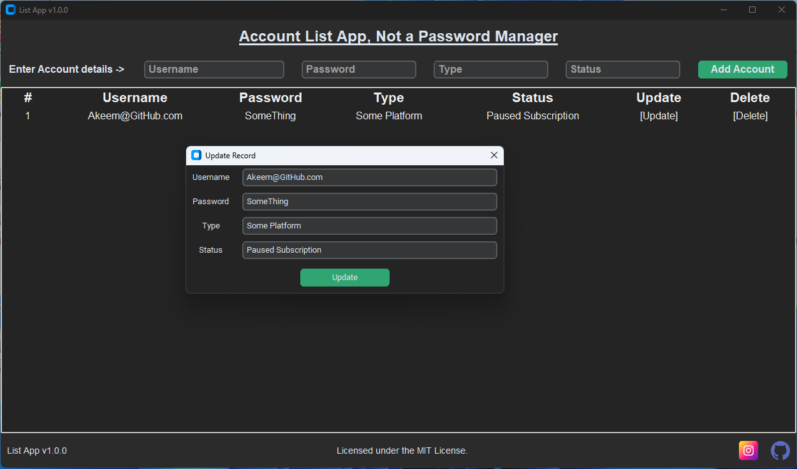
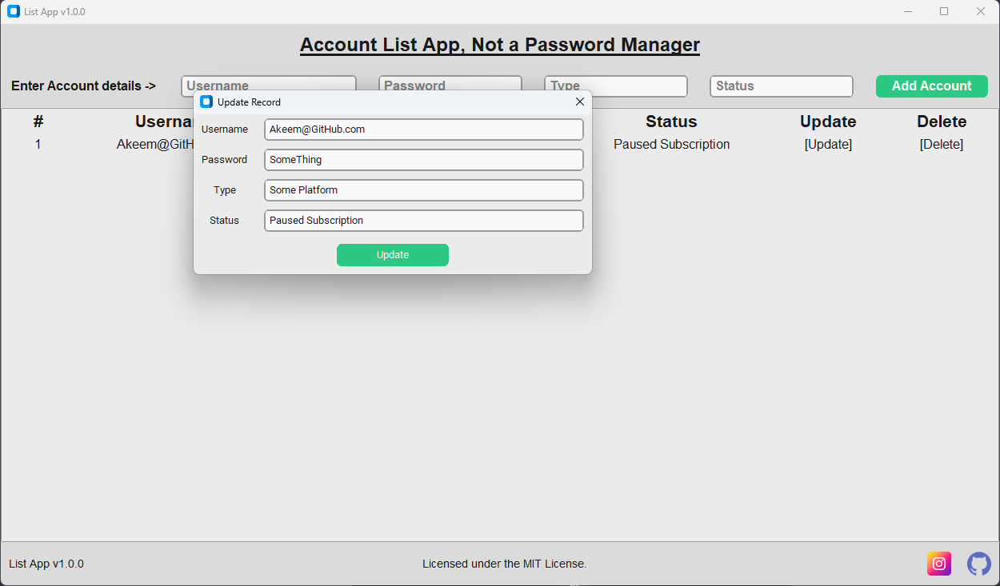

[![Issues][issues-shield]][issues-url]
[![MIT License][license-shield]][license-url]
[![LinkedIn][linkedin-shield]][linkedin-url]

# Python Detailed List App

## Introduction

Python Detailed List App is a Python application designed to help users keep track of a list of accounts. This tool is specifically developed to manage account details and is not intended to be used as a password manager.

 

  

## Installation

No installation required, simply download the application from the [Releases Page](https://github.com/prince-akeem/List-App/releases) then run it.

## Features and Functionality

The Python Detailed List App comes with several key features:

- **Add**: Easily add new accounts to your list.
  - **Hotkey**: Press 'tab' will move to the next entry, press 'enter' on Status entry to confirm add.
- **Remove**: Remove accounts that you no longer need to track.
  - **Hotkey**: while row is highlighted, press 'delete' to start deletion.
- **Update**: Keep your account list up-to-date with easy update options.
  - **Hotkey**: while row is highlighted, press 'enter' to start edit.
  - **Hotkey**: At anytime in the edit dialog window, press 'enter' to save the changes.
- **Appearance Mode**: defaults to system settings

### Screenshots

- **Dark Mode**

  

    
  

- **Light Mode**

  

    
  

## Roadmap

- [x] Add Changelog and update README.md
- [x] Add GUI to List App
- [ ] Add style for Update and Delete buttons
- [ ] Add data encryption
- [ ] Multi-language Support
    - [ ] Chinese
    - [ ] Spanish

See the [open issues](https://github.com/prince-akeem/List-App/issues) for a full list of proposed features (and known issues).

## License

Distributed under the MIT License. See `LICENSE.txt` for more information.

## Acknowledgments

Use this space to list resources you find helpful and would like to give credit to. I've included a few of my favorites to kick things off!

* [Choose an Open Source License](https://choosealicense.com)
* [GitHub Emoji Cheat Sheet](https://www.webpagefx.com/tools/emoji-cheat-sheet)
* [Malven's Flexbox Cheatsheet](https://flexbox.malven.co/)
* [Malven's Grid Cheatsheet](https://grid.malven.co/)
* [Img Shields](https://shields.io)
* [Best-README-template](https://github.com/othneildrew/Best-README-Template)
* [CustomTkinter](https://customtkinter.tomschimansky.com)

<!-- MARKDOWN LINKS & IMAGES -->
<!-- https://www.markdownguide.org/basic-syntax/#reference-style-links -->
[issues-shield]: https://img.shields.io/github/issues/prince-akeem/List-App.svg?style=for-the-badge
[issues-url]: https://github.com/prince-akeem/List-App/issues
[license-shield]: https://img.shields.io/github/license/prince-akeem/List-App.svg?style=for-the-badge
[license-url]: https://github.com/prince-akeem/List-App/blob/main/LICENSE.txt
[linkedin-shield]: https://img.shields.io/badge/-LinkedIn-black.svg?style=for-the-badge&logo=linkedin&colorB=555
[linkedin-url]: https://www.linkedin.com/in/akeem-piggott-6201b6157
